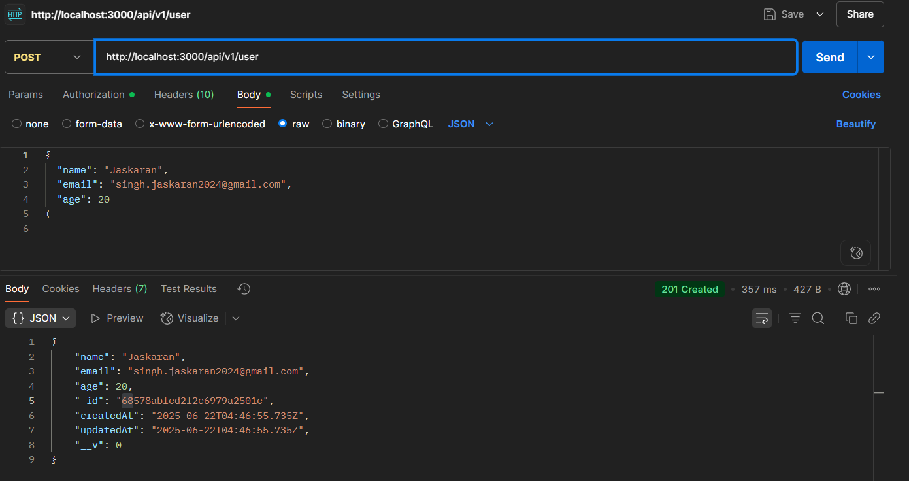
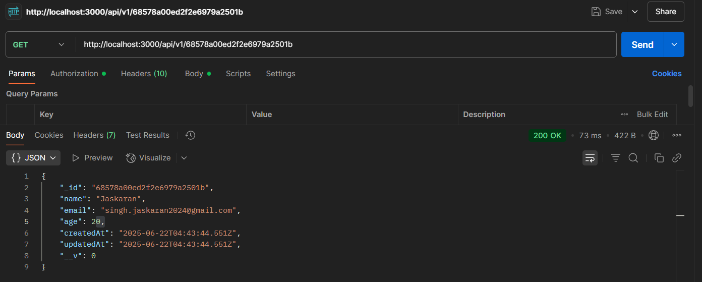
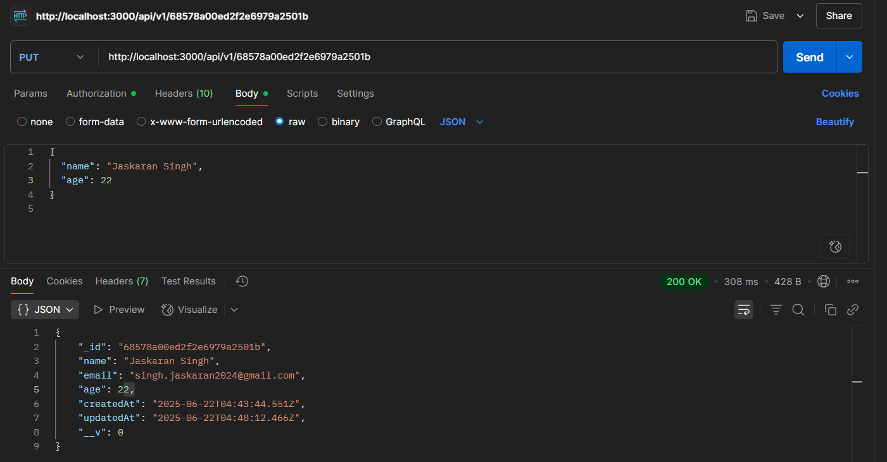
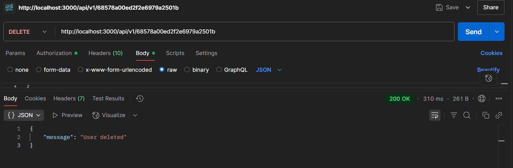

# 🧩 Node.js + Express + Mongoose CRUD API

This project is a simple CRUD (Create, Read, Update, Delete) API built using **Node.js**, **Express**, and **Mongoose** for MongoDB.

---

## 📦 Features

- ✅ Create a new user
- 🔍 Get a user by ID
- ✏️ Update a user
- ❌ Delete a user

---

## 🚀 How to Run

```bash
git clone <repo-url>
cd <your-folder>
npm install
npx nodemon src/index.js
```

# Requests

### Create User

###### URL: http://localhost:3000/api/v1/user [POST]



### Get By Id

###### URL: http://localhost:3000/api/v1/:id [GET]



### Update User

###### URL: http://localhost:3000/api/v1/:id [PUT]



### Delete User

###### URL: http://localhost:3000/api/v1/:id [DEL]


